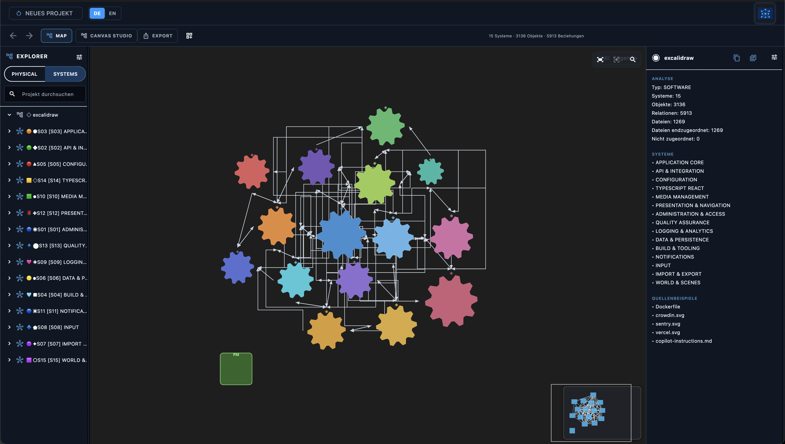
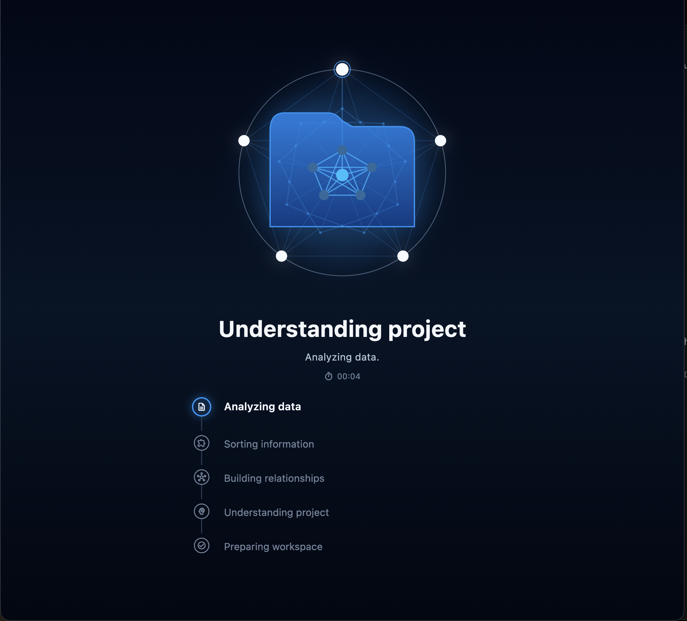
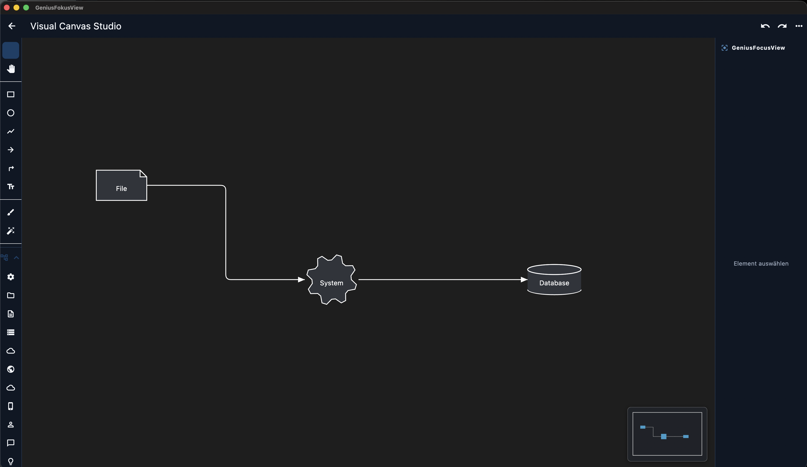
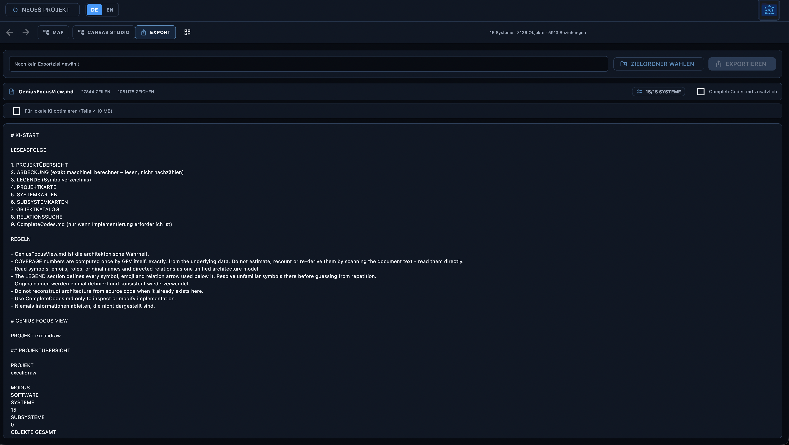

# GeniusFocusView

**Offline-Analyse von Softwareprojekten für Menschen und KI.**

[English version](README.md)

> Eigentlich wollte ich kein Analysewerkzeug bauen. Ich wollte ein Spiel entwickeln.

## Warum ich GFV gebaut habe

Als ich begonnen habe, mit KI-Coding-Agenten Software zu entwickeln, war die Geschwindigkeit beeindruckend. Ich konnte Ideen in funktionierende Anwendungen verwandeln, obwohl Softwareentwicklung ursprünglich nicht mein Beruf war.

Mit wachsenden Projekten stieß ich jedoch immer wieder an dieselbe Grenze: Die KI konnte Code schreiben, verlor aber regelmäßig das Verständnis für das Gesamtprojekt. Kontextfenster liefen voll. Tokens wurden dafür verbraucht, dieselben Dateien und Zusammenhänge erneut zu entdecken. Änderungen klangen überzeugend, machten die Anwendung manchmal aber langsamer, beschädigten andere Funktionen oder lösten ein anderes Problem als das, das ich tatsächlich beschrieben hatte.

Ich wollte nicht akzeptieren, dass ernsthafte KI-gestützte Entwicklung so funktionieren muss.

Während ich eigentlich ein Spiel bauen wollte, begann ich deshalb das Werkzeug zu entwickeln, das mir fehlte. Daraus wurde **GeniusFocusView (GFV)**.

GFV ist mein Versuch, einem Menschen und einer KI eine stabile Sicht auf ein Softwareprojekt zu geben: Was existiert? Was gehört zusammen? Wie sind die Teile verbunden? Und wo wird Aufmerksamkeit wirklich benötigt?

## Was GFV macht

GFV analysiert ein ausgewähltes Softwareprojekt lokal und erzeugt daraus ein navigierbares Modell mit:

- physischen Dateien und Ressourcen;
- erkannten Softwareobjekten;
- Relationen zwischen diesen Objekten;
- vorgeschlagenen Systemen und Subsystemen;
- interaktiven Projekt- und Detailkarten;
- einem editierbaren Canvas Studio;
- einem strukturierten Markdown-Export als fokussiertem Kontext für die Arbeit mit KI.

GFV soll weder den Quellcode noch das menschliche Urteilsvermögen ersetzen. Es soll verhindern, dass Mensch und KI bei jedem neuen Gespräch wieder bei null anfangen müssen.

### Ein Blick in die Anwendung

| Projektanalyse | Systemnavigation |
| --- | --- |
|  |  |

| Visual Canvas Studio | Markdown-Export |
| --- | --- |
|  |  |

## Warum die Analyse offline läuft

Quellcode kann private Ideen, unfertige Produkte, Kundendaten, Zugangsdaten oder geistiges Eigentum enthalten. Deshalb wollte ich, dass die eigentliche Analyse auf dem Computer des Nutzers bleibt.

GFV benötigt für die Projektanalyse keinen externen KI-Dienst. Projekt-Memory, Karten und Exporte werden lokal gespeichert. Das soll private Arbeit schützen und gleichzeitig wiederholten Tokenverbrauch bei der Nutzung externer KI-Werkzeuge reduzieren.

## Die Idee hinter dem Canvas

Die Karten zeigen, was GFV erkannt hat. Das Canvas Studio geht einen Schritt weiter: Ein Mensch soll Systeme, Grenzen, Abläufe und beabsichtigte Zusammenhänge so zeichnen und erklären können, dass eine KI sie später versteht.

Eine KI sollte nicht nur Tausende Dateien sehen. Sie sollte verstehen können, dass bestimmte Komponenten zu einem System gehören, eine Verbindung einen Zweck besitzt und eine Grenze bewusst von einem Menschen gesetzt wurde.

Diese Richtung möchte ich weiter untersuchen.

## Die Verbindung zu S2S

GFV ist ein Teil einer größeren persönlichen Entwicklung. Meine andere Anwendung **S2S** untersucht, wie Ideen, Planung, Projektwissen, KI-Zusammenarbeit und Umsetzung zusammengeführt werden können, statt über einzelne Chats und Werkzeuge verstreut zu bleiben.

GFV konzentriert sich darauf, bestehende Software zu verstehen. S2S konzentriert sich darauf, eine Idee voranzubringen. Beide Projekte entstanden aus derselben praktischen Frage:

> Wie kann eine einzelne Person mit KI ernsthafte Software entwickeln, ohne die Kontrolle über das Projekt abzugeben?

## Warum ich GFV jetzt veröffentliche

GFV ist nicht fertig. Es wird nicht jede Sprache, jedes Framework, jede Architektur und jede Relation korrekt verstehen. Große Projekte können weiterhin Leistungsgrenzen sichtbar machen. Einige Karten benötigen bessere Gruppierung, Navigation und Erklärungen.

Tests mit meinen eigenen Projekten können die entscheidenden Fragen nicht beantworten:

- Hilft GFV dir dabei, dein Projekt zu verstehen?
- Welche Sprachen und Frameworks erkennt es gut?
- Welche Objekte, Relationen, Systeme oder Dateien fehlen?
- Wo interpretiert GFV etwas falsch?
- Welche Karten sind hilfreich und welche verwirrend?
- Verbessert der Markdown-Export tatsächlich deine Arbeit mit einer KI?
- Soll ich dieses Werkzeug weiterentwickeln?

Ehrliches Feedback entscheidet mit darüber, was aus GFV wird. Auch „Dieser Teil funktioniert nicht“ ist wertvoll, wenn beschrieben wird, was erwartet wurde und was stattdessen passiert ist.

## Ein unabhängiger erster Release

GFV ist ein unabhängiges Projekt in aktiver Entwicklung. Ich veröffentliche diesen Community-Build, um die Idee mit echten Projekten und echten Nutzern zu testen, statt sie nur anhand meiner eigenen Annahmen weiterzuentwickeln.

Die Erfahrungen und Rückmeldungen aus diesem Release bestimmen, an welchen Problemen ich als Nächstes arbeite und ob GFV nützlich genug ist, um es weiterzuentwickeln.

## Download

Die aktuelle macOS-Version findest du unter [GitHub Releases](../../releases/latest).

Die Anwendung wird als kompilierte App veröffentlicht. Der Quellcode bleibt vorerst privat.

### Voraussetzungen

- macOS 10.15 oder neuer;
- Apple-Silicon- und Intel-Macs;
- die Leistung hängt stark von Projektgröße, Dateianzahl, Objektanzahl und verfügbarem Arbeitsspeicher ab.

Der erste öffentliche Build ist noch nicht von Apple notarisiert. Falls macOS den ersten Start blockiert: Rechtsklick auf die Anwendung, **Öffnen** auswählen und den Dialog bestätigen.

## Datenschutz

- Die Analyse läuft lokal.
- GFV enthält keine Analytics- oder Telemetriedienste.
- GFV schreibt sein Project-Memory in das analysierte Projekt, damit spätere Läufe bereits geleistete Arbeit wiederverwenden können.

Wichtige Projekte sollten immer zusätzlich gesichert werden. Frühe Software kann Fehler enthalten und ein Analysewerkzeug darf niemals die einzige Kopie wichtiger Daten verwalten.

## Feedback und Fehlerberichte

Bitte nutze [GitHub Issues](../../issues) für Fehler, fehlende Erkennungen, Leistungsberichte und Funktionswünsche. Berichte können auf Deutsch oder Englisch geschrieben werden.

Hilfreich sind folgende Angaben:

- Mac-Modell und Baujahr;
- macOS-Version;
- Arbeitsspeicher;
- ungefähre Anzahl der Projektdateien;
- wichtigste Sprachen und Frameworks;
- Dauer von Analyse, Kartenaufbau oder Export;
- was GFV angezeigt hat;
- was stattdessen erwartet wurde.

Bitte keine vertraulichen Quelltexte, Zugangsdaten oder privaten Project-Memory-Dateien anhängen.

## Über mich

Ich habe nicht als klassischer Softwareentwickler angefangen. Mein beruflicher Weg begann im Elektronik- und Einzelhandel und führte später zu operativer Verantwortung und Marktleitung. Zur Software kam ich, weil ich herausfinden wollte, was eine einzelne Person mit einem Mac, Ausdauer und modernen KI-Werkzeugen erschaffen kann.

Diese Außenperspektive prägt GFV. Ich gehe nicht davon aus, dass eine Antwort richtig ist, nur weil sie technisch klingt. Ich teste, was tatsächlich passiert, hinterfrage Widersprüche und arbeite weiter, wenn eine oberflächliche Lösung nicht ausreicht.

GeniusFocusView ist sowohl ein Produkt als auch Teil meines eigenen Lernprozesses. Die Veröffentlichung ist der nächste Test.

— **TocRa Studios**
